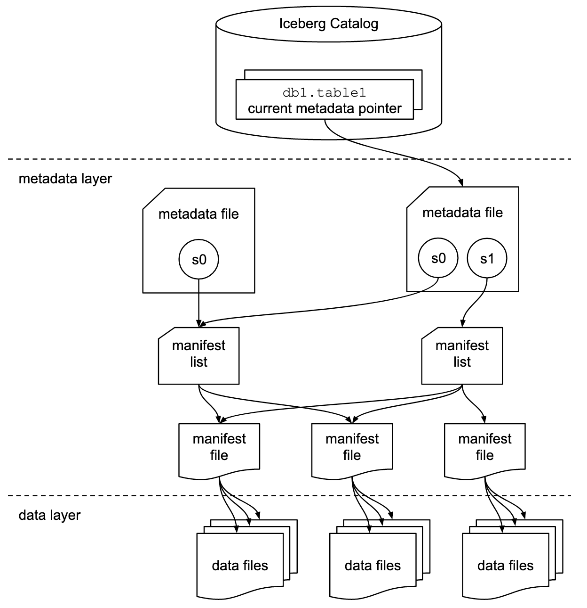
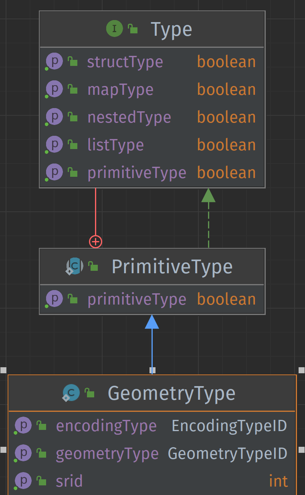
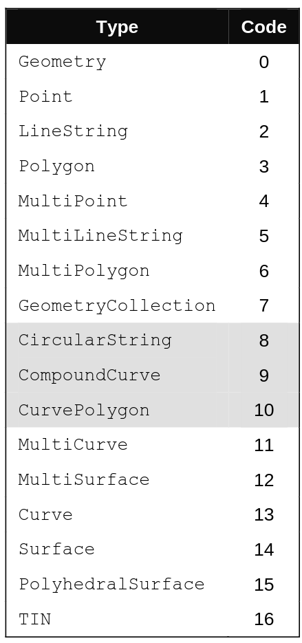
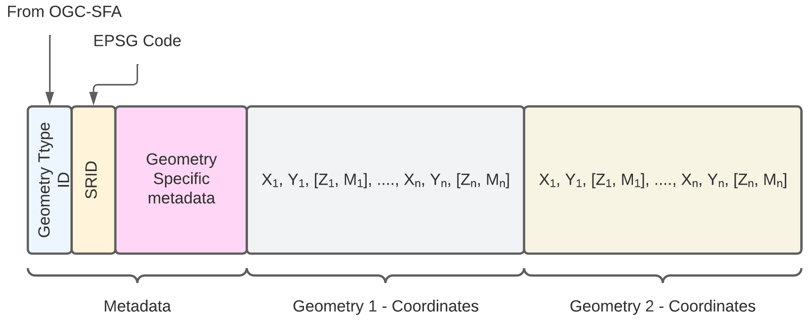
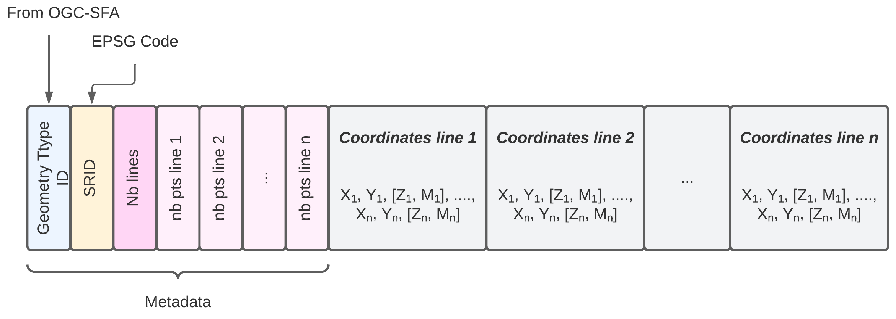
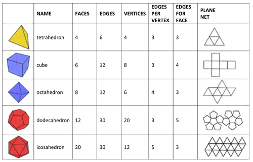
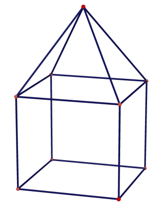

# Spécification pour l'encodage du type géométrique 3D dans Apache Iceberg

## Introduction

Cette spécification, dénommée GeoIceberg, détaille la manière d'ajouter la prise en charge du type géométrique dans Apache Iceberg afin de stocker des données géospatiales dans une table Iceberg. Cette spécification d'appuie sur l'utilisation de la norme **ISO-19107** et de la spécification **OGC-Simple Feature Access**.

Il s'agit actuellement d'un travail en cours et donc d'une version bêta. Ce travail a été initié dans le cadre d'un travail de recherche de maîtrise réalisé à l'Université Laval, Québec, Canada, par Xavier Malet sous la supervision du Prof. Thierry Badard. Ce travail de recherche visait à concevoir un moteur de lac de données géospatiales 3D basé sur le Trino. Pour toute question ou si vous souhaitez contribuer, veuillez envoyer un courriel à [Thierry Badard](mailto:Thierry.Badard@scg.ulaval.ca).

Ce document a été mis à jour la dernière fois, le 20 octobre 2024.

## Contexte

**Apache Iceberg** est un système de gestion de données open source conçu pour stocker, gérer et versionner de grandes quantités de données structurées.

Il offre une prise en charge complète de l'évolution des données et de la gestion des partitions. Il fonctionne avec des formats de données tels que Parquet et ORC.

Iceberg est idéal pour le stockage de grandes quantités de données, permettant une évolution transparente des schémas et une gestion fiable des données à grande échelle.

Cependant, par défaut, il ne prend pas en charge les types de données géométriques. Cette spécification propose un encodage qui  permet le stockage des données de type géométrique à l'intérieur d'une table de données Apache Iceberg.

## Reconnaissance du type géométrique dans Apache Iceberg

Afin que le type géométrique soit reconnu dans Apache Iceberg, il
est nécessaire d'ajouter des mécanismes de reconnaissance, de stockage et de gestion
des données géométriques dans:

- Le [`Schema`](https://iceberg.apache.org/spec/#schemas-and-data-types)
    - Sauvegarde du type de géométrie utilisé
- Le [`Partitionnement`](https://iceberg.apache.org/spec/#partitioning)
    - Permet de définir le partitionnement géospatial d'une table
- Le [`Manifest`](https://iceberg.apache.org/spec/#manifests)
    - Ajout de métriques géospatiales:
        - XMin / XMax / YMin / YMax
        - BBox
- Le stockage
    - Ajout d'encodeur / décodeurs de données géométriques pour les formats
      de stockage utilisés par `Apache Iceberg` soit:
        - Parquet
        - Avro
        - Orc

L'ensemble de ces informations se retrouve disséminées dans les fichiers
de métadonnées ([`metadata files`](https://iceberg.apache.org/spec/#table-metadata))
et dans les [`manifest files`](https://iceberg.apache.org/spec/#manifests).
Les `data files` correspondent au stockage dans les fichiers de type `Parquet`, `Orc`, `Avro`.

<figure>

<figcaption><i>Iceberg Table Structure</i> ( from : <a href="https://iceberg.apache.org/spec/#overview">Iceberg Spec</a> )</figcaption>
</figure>


Les sections suivantes permettent de définir:

- Le type géométrique dans Apache Iceberg
- L'utilisation et la définition du type géométrique dans le schéma Iceberg
- La lecture/écriture des géométries dans les fichiers de stockage
- L'utilisation du partitionnement géospatial

## Schéma de la table Iceberg

Afin d'ajouter un type géométrique dans Iceberg, il est nécessaire définir un nouveau type géométrique tel que défini plus haut.




### Exemple de schéma en pseudo-code :

En Java
```javascript
StructType SCHEMA = StructType.of(
    required(
        200, // field id
        "geometry", // field name
        Types.GeometryType.of("pointzm", 2949, 'WKT')   // field type
    )   
);
```

En SQL
```sql
create table TABLE_NAME (
    geom geometry('Pointz',2949,'wkt')
)
```
Cette nommenclature correspond à celle utilisée par [`PostGIS`](https://postgis.net/)

### Partitions

Si le partitionnement des données géométriques est nécessaire, les colonnes de partitionnement doivent être planifiées
en conséquence. Par exemple, les données géométriques peuvent être partitionnées en fonction de la région géographique,
de la date, etc.

Plusieurs type de partitionnement géospatiaux peuvent être utilisés tel que :

  - [Geohash](https://en.wikipedia.org/wiki/Geohash)
  - [Z-Curve Order](https://en.wikipedia.org/wiki/Z-order_curve)
  - [H3](https://h3geo.org/)
  - [Google S2](https://s2geometry.io/)

Pour chaque partitionnement, il faut spécifier une longueur de hashage afin de regrouper les différentes géométries
dans le même espace.

La déclaration du partitionnement géospatial peut être définie comme:

```
GEOPARTITION( TYPE (h2, geohash, ...), NOM COL. GEOMETRIQUE, LONGUEUR DE HASHAGE )

## Exemple

-- partitionnement spatial de type h2 de longueur 5 sur la colonne geometry_col
GEOPARTITION( 'h2',geometry_col , 5 ) 

-- partitionnement spatial de type geohash de longueur 5 sur la colonne geometry_col
GEOPARTITION( 'geohash',geometry_col , 5 ) 

```


#### Exemple de schéma en pseudo-code :

En SQL (exemple avec l'API de `Iceberg - Spark`)

```sql
CREATE TABLE prod.db.sample (
    id bigint,
    geom geometry('pointz',2949,'wkb'))
USING iceberg
PARTITIONED BY (geopartition('geohash',geom, 5))
```

### Indexation

[A COMPLETER]
Pour des performances de recherche optimales, il est possible d'ajouter des indexes spatiaux pour accélérer
la recherche de données géométriques.


## Lecture/Écriture des données géométriques

L'application utilisant Iceberg doit être capable de lire et d'écrire des données géométriques dans la table Iceberg en
utilisant le type de donnée géométrique approprié.

Les données géométriques seront stockées dans un format de données compatible avec Iceberg, tel que Parquet ou ORC.
L'application doit prendre en charge la conversion des données géométriques dans ce format.


## Définition du type de donnée géométrique

Le type géométrique doit permettre de savoir:

- Le type de géométrie utilisée (Point, Ligne, Polygone, ...).
- Le système de coordonnées (au format EPSG).
- Le type d'encodage utilisé pour sérialiser/ déserialiser l'objet géométrique dans les fichiers de stockage.

La définition du type peut être créée en SQL ou en ligne de commande avec les paramètres nommés ci-dessus.

___Exemple de définition du type :___

```javascript
// Objet de type Point avec CRS : WGS-84 encodé en WKB
GeometryType("point", 4326, "WKB")

// Objet de type Point avec CRS : UTM-NAD83 Zone 19 encodé en Liste
GeometryType("point", 26919, "List")

// Objet de type Polygone avec CRS : UTM-NAD83 Zone 20 encodé en WKT
GeometryType("polygon", 26920, "WKT")

// Objet de type PointZ avec CRS : UTM-NAD83 Zone 20 encodé en WKT
GeometryType("pointz", 26920, "WKT")

// Objet de type PolygoneZ avec CRS : UTM-NAD83 Zone 20 encodé en WKT
GeometryType("polygonz", 26920, "WKT")
```

### Types de géométries supportés

Les objets de base supportés par la spécification [`OGC-Simple Feature Access`](https://www.ogc.org/publications/standard/sfs/) sont :
<figure>

<figcaption><b>Fig 1</b> : Geometry Type ID From OGC-SFA</figcaption>
</figure>

Pour supporter les géométries 2.5D, il suffit d'additionner les valeurs suivantes
pour définir les objets sous format `XYZ`, `XYM` et `XYZM`

- `XYZ`: 1000
- `XYM` : 2000
- `XYZM` : 3000

___Exemple___:

- __PointZ__ : 1001
- __PointM__ : 2001
- __PointZM__: 3001

- __PolygonZ__ : 1003
- __PolygonM__ : 2003
- __PolygonM__: 3003

### Système de coordonnées

Pour identifier le système de coordonnées, l'utilisation des codes `EPSG` est à
prioriser.

### Encodage des géométries

Parmi les encodages existants, on peut nommer :

- ___Well-Known Text (WKT)___: Une représentation textuelle, lisible par l'homme, des géométries.
  Il est utilisé pour stocker des géométries de manière lisible et interprétable.


- ___Well-Known Binary (WKB)___ : Une représentation binaire compacte des géométries,
  ce qui la rend plus efficace pour le stockage et la transmission.


- ___Tiny Well-Known Binary (TinyWKB)___ : Forme compacte du __WKB__ utilisé pour représenter des données géospatiales
  de
  manière efficace. Il est principalement conçu pour réduire la taille des données géospatiales lorsqu'elles sont
  stockées ou transmises, tout en conservant une représentation binaire simple.


- ___GeoJSON___ : Un format JSON couramment utilisé pour représenter des objets géospatiaux. Il est lisible par l'homme
  et pris en charge par de nombreuses bibliothèques et outils géospatiaux.

Cependant, afin de stocker de façon efficace les données géométriques dans les fichiers supportés par Apache Iceberg, les types d'encodage basés sur les listes, sont à privilégier pour des raisons d'efficacité et de performance :

- ___Encodage en listes simples (SimpleList)___ : Cet encodage ressemble beaucoup à l'encodage WKB. Cependant,
  au lieu d'être incorporé à l'intérieur d'une représentation binaire, la géométrie
  est stockée à l'intérieur d'un conteneur existant, comme un objet de type `List` ou `Array`.
  Cet encodage peut être difficile à lire et à décoder mais, il est plus compacte.


- ___Encodage en liste imbriquées (NestedList)___ : L'encodage en listes imbriquées
  permet le stockage des coordonnées à l'intérieur de liste isolée et peut simplifier
  le processus de lecture/écriture. Ce type d'encodage est en partie utilisé
  dans l'encodage de type `GeoJSON`. Il est plus facilement lisible par un être humain
  mais est moins compact.

Pour stocker les objets géométriques dans Apache Iceberg, la correspondance suivante peut être utilisée:

| Type d'encodage<br>choisi | Correspondance de<br>type  Apache Iceberg | Correspondance AVRO<br>(de la spec Apache Iceberg) | Correspondance Parquet<br>(de la spec Apache Iceberg) | Correspondance Orc<br>(de la spec Apache Iceberg) |
|------------------------|:--------------------------------------:|:------------------------------------------------:|:---------------------------------------------------:|:-----------------------------------------------:|
| WKT                    |                `string`                |                      String                      |                       binary                        |                     string                      |
| WKB / TinyWKB          |                `binary`                |                      bytes                       |                       binary                        |                     binary                      |
| SimpleList             |            `List( double )`            |                 array[ double ]                  |                    3-level list                     |                 array[ double]                  |
| NestedList             |        `List( List( double ))`         |             array[ array[ double ]]              |                    3-level list                     |             array[ array[ double ]]             |


## Encodage à base de listes


Cette section présente l'encodage des géométries à l'aide de l'utilisation de 
listes simples. Ce type d'encodage a notamment été proposé par [geoarrow](https://github.com/geoarrow/geoarrow). 
Cependant, différents éléments ont été ajoutés afin de sauvegarder à l'intérieur de la 
liste, les métadonnées des géométries.

Le schéma suivant présente la structure de base de l'encodage des géométries en liste simple.

<figure>
    
    <figcaption>Représentation schématique de l'encodage en liste simple</figcaption>
</figure>

### Encodage Point (`Point`)

- Metadonnées
  - Geometry Type ID: `1 ; 1001; 2001; 3001`
  - SRID : `int` 
  - Geometry Specific Metadata : `None`
- Encoded Coordinates
  - X, Y, Z, M

___Exemple encodage point___

```python
# SRID : 2949
# Point avec coordonnées : (10,11)
[1, 2949, 10, 11]

# PointZ avec coordonnées : (10,11, 5)
[1001, 2949, 10, 11, 5]

# PointM avec coordonnées : (10,11, -15)
[2001, 2949, 10, 11, -15]

# PointZM avec coordonnées : (10,11, 5, -15)
[3001, 2949, 10, 11, 5, -15]
```
### Encodage Ligne (`LineString`)

- Metadonnées
  - Geometry Type ID: `2 ; 1002; 2002; 3002`
  - SRID : `int` 
  - Geometry Specific Metadata : 
    - dimension (dim): `int` : 2 < `x` < 4
    - number of points (nbp): `int` : > 1
- Encoded Coordinates
  - X<sub>1</sub>, Y<sub>1</sub>, Z<sub>1</sub>, M<sub>1</sub>, X<sub>2</sub>, Y<sub>2</sub>, Z<sub>2</sub>, M<sub>2</sub> ... X<sub>n</sub>, Y<sub>n</sub>, Z<sub>n</sub>, M<sub>n</sub>

___Exemple encodage Ligne___

```python
# SRID : 2949
# Ligne avec coordonnées : [ (0,0), (1,1), (5,5) ]
#                              |      |      |   
#                         coord 1   coord 2  coord 3
[2, 2949, 2, 3, 0,0,1,1,5,5]
#               ___ ___ ___
#         |  |   |   |   |
#       dim nbp  c1  c2  c3

# SRID : 2949
# LigneZ avec coordonnées : [ (0,0,0 ), (1,1,2), (5,5,10) ]
#                                |         |       |   
#                            coord 1   coord 2  coord 3
[1002, 2949, 3, 3, 0,0,0,1,1,2,5,5,10]
#                  _____ _____ _____
#            |  |    |     |     |
#          dim nbp  c1     c2    c3


# SRID : 2949
# LigneM avec coordonnées : [ (0,0,10 ), (1,1,11), (5,5,12) ]
#                                |         |       |   
#                            coord 1   coord 2  coord 3
[2002, 2949, 3, 3, 0,0,10,1,1,11,5,5,12]
#                  _____  _____  _____
#            |  |    |      |     |
#          dim nbp  c1     c2    c3

# SRID : 2949
# LigneZM avec coordonnées : [ (0,0,1,10 ), (1,1,5,11), (5,5,9,12) ]
#                                  |            |            |   
#                            coord 1          coord 2       coord 3
[3002, 2949, 4, 3, 0,0,1,10,1,1,5,11,5,5,9,12]
#                  ________ ________ ________
#            |  |      |        |       |
#          dim nbp     c1       c2      c3
```
### Encodage des géométries multiples

L'encodage des géométries multiples est plus complexe étant donnée que le bloc de 
métadonnée devient plus important.

<figure>
  
  <figcaption>Schéma d'encodage de base des géométries multiples</figcaption>
</figure>

#### Encodage Polygone (`Polygon`)

<figure>
  
  <figcaption>Schéma d'encodage d'un polygone</figcaption>
</figure>

- Metadonnées
  - Geometry Type ID: `3 ; 1003; 2003; 3003`
  - SRID : `int` 
  - Geometry Specific Metadata : 
    - dimension (dim): `int` : 2 < `x` < 4
    - Bordure extérieur (___Exterior Ring___):
      - number of points (nbp): `int` : > 1
    - Anneaux intérieurs (___Interior Ring___)
      - Ring Number : `int` : 0 < X < n
      - For each ring: `int`
        - number of points (nbp): `int` : > 1
- Encoded Coordinates
  - X<sub>1</sub>, Y<sub>1</sub>, Z<sub>1</sub>, M<sub>1</sub>, X<sub>2</sub>, Y<sub>2</sub>, Z<sub>2</sub>, M<sub>2</sub> ... X<sub>n</sub>, Y<sub>n</sub>, Z<sub>n</sub>, M<sub>n</sub>
  - For each ring:
    - X<sub>1<sub>ring i</sub></sub>, Y<sub>1<sub>ring i</sub></sub>, Z<sub>1<sub>ring i</sub></sub>, M<sub>1<sub>ring i</sub></sub>, 
        X<sub>2<sub>ring i</sub></sub>, Y<sub>2<sub>ring i</sub></sub>, Z<sub>2<sub>ring i</sub></sub>, M<sub>2<sub>ring i</sub></sub> ... X<sub>n<sub>ring i</sub></sub>, Y<sub>n<sub>ring i</sub></sub>, Z<sub>n<sub>ring i</sub></sub>, M<sub>n<sub>ring i</sub></sub>

```python
# SRID : 2949
# Polygone avec bordure : [ (0,0) , (0,5) , (5,5) , (5,0) , (0,0) ]
# Anneau 1 : A1 [ (1,1) , (1,2) , (2,2) , (2,1) , (1,1) ]
# Anneau 2 : A2 [ (3,3) , (3,4) , (4,4) , (4,3) , (3,3) ]

#          5,5                     5,0
#             ┌───────────────────┐
#             │         4,3   4,4 │
#             │           ┌────┐  │
#             │           │    │  │
#             │           │ a2 │  │
#             │ 2,1  2,2  └────┘  │
#             │  ┌────┐   3,3  3,4│
#             │  │    │           │
#             │  │ a1 │           │
#             │  └────┘           │
#             │ 1,1     1,2       │
#             └───────────────────┘
#           0,0                    0,5


# Polygone avec bordure : [ (0,0) , (0,5) , (5,5) , (5,0) , (0,0) ]
# sans anneau
[3, 2949, 2, 5, 0 , 0,0 , 0,5 , 5,5 , 5,0 , 0,0]
#         │  │  │   ─┬─   ─┬─   ─┬─   ─┬─   ─┬─
#         │  │  │    │     │     │     │     │
#       dim  │ nr    │     │     │     │     │
#           nbp      c1    c2    c3    c4    c5


# Polygone avec bordure : [ (0,0) , (0,5) , (5,5) , (5,0) , (0,0) ]
# avec Anneau A1
# Anneau 1 : A1 [ (1,1) , (1,2) , (2,2) , (2,1) , (1,1) ]
[3, 2949, 2, 5, 1 , 5, 0,0 , 0,5 , 5,5 , 5,0 , 0,0 , 1,1 , 1,2 , 2,2 , 2,1 , 1,1 ]
#         │  │  │   │  ─┬─   ─┬─   ─┬─   ─┬─   ─┬─   ─┬─   ─┬─   ─┬─   ─┬─   ─┬─
#         │  │  │   │   │     │     │     │     │     │     │     │     │     │
#       dim  │ nr   │   │ Coordonnées extérieur │     │     │     │     │     │
#                   │   │     |     |     |     │     │ Coordonnées Anneau A1 │
#           nbp     │   c1    c2    c3    c4    c5    │     │     │     │     │
#                  nbp                                │     │     │     │     │
#                 ring 1                              │     │     │     │     │
#                                                     c1    c2    c3    c4    c5


# Polygone avec bordure : [ (0,0) , (0,5) , (5,5) , (5,0) , (0,0) ]
# avec Anneau A1, A2
# Anneau 1 : A1 [ (1,1) , (1,2) , (2,2) , (2,1) , (1,1) ]
# Anneau 2 : A2 [ (3,3) , (3,4) , (4,4) , (4,3) , (3,3) ]
[3, 2949, 2, 5, 2 , 5, 6 , 0,0 , 0,5 , 5,5 , 5,0 , 0,0 , 1,1 , 1,2 , 2,2 , 2,1 , 1,1 , 3,3 , 3,4 , 4,4 , 4,3 , 2.5,3.5 , 3,3 ]
#         │  │  │   │  │   ─┬─   ─┬─   ─┬─   ─┬─   ─┬─   ─┬─   ─┬─   ─┬─   ─┬─   ─┬─   ─┬─   ─┬─   ─┬─   ─┬─   ─┬─────   ─┬─
#         │  │  │   │  │    │     │     │     │     │     │     │     │     │     │     │     │     │     │     │         │
#       dim  │ nr   │  │    │ Coordonnées extérieur │     │     │     │     │     │     │     │     │     │     │         │
#                  nbp │    │     |     |     |     │     │ Coordonnées Anneau A1 │     │ Coordonnées Anneau A2 │         │
#           nbp  ring1 │    c1    c2    c3    c4    c5    │     │     │     │     │     │     │     │     │     │         │
#                      nbp                                │     │     │     │     │     c1    c2    c3    c4    c5       c6
#                    ring2                                │     │     │     │     │
#                                                         c1    c2    c3    c4    c5


# PolygonZ: [ (0,0,10) , (0,5,10) , (5,5,10) , (5,0,10) , (0,0,10) ]
# sans anneau
[3, 2949, 3, 5, 0 , 0,0,10 , 0,5,10 , 5,5,10 , 5,0,10 , 0,0,10]
#         │  │  │   ──┬───   ──┬───   ──┬───   ──┬───   ──┬───
#         │  │  │     │        │        │        │        │
#       dim  │ nr     │        │        │        │        │
#           nbp      c1       c2       c3       c4       c5
````

#### Encodage MultiPoints

- Metadonnées
  - Geometry Type ID: `4 ; 1004; 2004; 3004`
  - SRID : `int` 
  - Geometry Specific Metadata : 
    - dimension (dim): `int` : 2 < `x` < 4
    - number of points (nbp): `int` : > 1

- Encoded Coordinates
    - X<sub>point 1</sub>, Y<sub>point 1</sub>, Z<sub>point 1</sub>, M<sub>point 1</sub>
    - X<sub>point n</sub>, Y<sub>point n</sub>, Z<sub>point n</sub>, M<sub>point n</sub>

```python
# SRID : 2949
# Liste de points : [ (0,0) , (0,5) , (5,5) , (5,0)  ]

# Multipoint 
[4, 2949, 2, 4, 0,0 , 0,5 , 5,5 , 5,0]
#         │  │  ─┬─   ─┬─   ─┬─   ─┬─
#       dim  │  p1    p2    p3    p4
#           nbp


# MultipointZ
# Liste de points : [ (0,0,5) , (0,5,14) , (5,5,34) , (5,0, 12)  ]
[1004, 2949, 3, 4, 0,0,5 , 0,5,14 , 5,5,34 , 5,0,12]
#            │  │  ──┬──   ──┬───   ──┬───   ──┬───
#          dim  │   p1      p2       p3       p4
#              nbp

```

#### Encodage Multilignes

<figure>
  
  <figcaption>Schéma d'encodage d'un polygone</figcaption>
</figure>


- Metadonnées
  - Geometry Type ID: `5 ; 1005; 2005; 3005`
  - SRID : `int` 
  - Geometry Specific Metadata : 
    - dimension (dim): `int` : 2 < `x` < 4
    - Nombre de lignes : `int` : 0 < X < n
      - Pour chaque lignes: `int`
        - nombre de points (nbp): `int` : > 1
- Encoded Coordinates
  - Pour chaque ligne:
    - X<sub>1<sub>ligne i</sub></sub>, Y<sub>1<sub>ligne i</sub></sub>, Z<sub>1<sub>ligne i</sub></sub>, M<sub>1<sub>ligne i</sub></sub>, 
        X<sub>2<sub>ligne i</sub></sub>, Y<sub>2<sub>ligne i</sub></sub>, Z<sub>2<sub>ligne i</sub></sub>, M<sub>2<sub>ligne i</sub></sub> ... X<sub>n<sub>ligne i</sub></sub>, Y<sub>n<sub>ligne i</sub></sub>, Z<sub>n<sub>ligne i</sub></sub>, M<sub>n<sub>ligne i</sub></sub>

```python
# SRID : 2949
# Ligne 1 : [ (1,1) , (1,2) , (2,2) , (2,1) ]
# Ligne 2 : [ (3,3) , (3,4) , (4,4) ]
# Ligne 3 : [ (0,0) , (0,5) , (5,5) , (5,10) , (10,10) ]

#              nbp1 nbp3
#               │     │
#               │     │
[5, 2949, 2, 3, 4, 3, 5, 1,1,1,2,2,2,2,1 , 3,3,3,4,4,4, 0,0,0,5,5,5,5,10,10,10]
#         │  │     │     ──────┬────────   ─────┬─────  ───────────┬──────────
#       dim  │     │           │                │                  │
#           nb    nbp2      x,y ligne 1                       x,y ligne 3
#          lignes                           x,y ligne 2

# Ligne 1 : [ (1,1,5) , (1,2,12) , (2,2,4) , (2,1,22) ]
# Ligne 2 : [ (3,3,0) , (3,4,12) , (4,4,23) ]
#                 nbp1
#                  │
#                  │
[1005, 2949, 3, 2, 4, 3, 1,1,5,1,2,12,2,2,4,2,1,22 , 3,3,0,3,4,12,4,4,23]
#            │  │     │  ──────────┬──────────────   ─────────┬─────────
#          dim  │     │            │                          │
#              nb    nbp2       x,y,z ligne 1            x,y,z ligne 2
#             lignes
```

#### Encodage MultiPolygones

A FAIRE.

### Encodage Polyhèdres et Solides (Polyhedral Surface)

Au niveau géométrique, un polyhèdre peut être une structure en 2D/3D et 
un solide est strictement 3D.

Les polyhèdres et solides sont composés de trois éléments importants:

 - Les `faces` : formes géométriques polygonales de base (triangle, carré, rectangle, ...) qui délimitent son extérieur.
 - Les sommets (`vectives`): ensemble des points composants les différentes `faces`
 - Les arêtes (`edges`): lignes droites où deux faces se rejoignent. Chaque arête relie deux sommets et délimite une ou plusieurs faces.

La figure ci-dessous présente différents polyhèdre de base ainsi
que les éléments qui les composent (`faces`, `vectives`, `edges`)


<div style="background-color:white;
text-align:center;">

<figure>

<figcaption>Exemple de polyhèdres </figcaption>
</figure>

</div>

L'encodage proposé ignore le stockage des `arêtes` mais stocke
le nombre de `sommets`, le nombre de `faces` ainsi que, pour chaque face, 
le nombre de points composant la face ainsi les index de ces points
dans la liste des coordonnées.

<figure>
  
  <figcaption>Schéma d'encodage d'un polygone</figcaption>
</figure>


- Metadonnées
  - Geometry Type ID: `15 ; 1015; 2015; 3015`
  - SRID : `int` 
  - Geometry Specific Metadata : 
    - dimension (dim): `int` : 2 < `x` < 4
    - Nombre de points : `int` : 1 < X < n
    - Nombre de faces : `int` : 1 < X' < n
      - Pour chaque face: `int`
        - nombre de points (nbp): `int` : > 1
        - index des points dans la liste `int`:
- Encoded Coordinates
  - L'ensemble des coordonnées:
    - X<sub>1</sub>, Y<sub>1</sub>, Z<sub>1</sub>, M<sub>1</sub>, 
        X<sub>2</sub>, Y<sub>2</sub>, Z<sub>2</sub>, M<sub>2</sub> ... X<sub>n</sub>, Y<sub>n</sub>, Z<sub>n</sub>, M<sub>n</sub>


___Exemple d'encodage d'un tétraèdre___
```python

# Encodage d'un tetraedre
# 
# 4 points
# 
# 0,0,0
# 1,0,0
# 1,1,0
# 1,1,1
# 
# Composition des faces
# 1: 1,2,3
# 2: 1,3,4
# 3: 1,2,4
# 4: 2,3,4

#                 nb        nb pts             nb pts
#               faces      face 2              face 4
#                  │           │  idx pts        │   idx pts
#                  │           │   │             │   │
#                  │           │ ──┴──           │ ──┴──
[1015, 2949, 3, 4, 4, 3,1,2,3 ,3,1,3,4, 3,1,2,4, 3,2,3,4 , 0,0,0, 1,0,0, 1,1,0, 1,1,1]
#            │  │     │ ──┬──           │ ─────            ──┬──  ─────  ──┬──  ─────
#          dim  │     │   │idx pts      │                    │     c2      │     c4
#              nb     │                 │                   c1            c3
#             points  nb pts          nb pts
#                     face 1         face 3
```

Exemple d'encodage d'une pyramide à base carrée sur un cube


```python
# Encodage d'un tetraedre
# 
# 9 points
# 
# index - coordonnées
# Cube
# 1     - 0,0,0
# 2     - 5,0,0
# 3     - 5,5,0
# 4     - 0,5,0
# 5     - 5,5,5
# 6     - 0,5,5
# 7     - 0,0,5
# 8     - 5,0,5
# Sommet de la Pyramide
# 9     - 2.5,7.5,2.5
# 
# Composition des faces

# Cube 
# 1,2,3,4
# 1,7,6,4
# 7,8,5,6
# 2,3,5,8
# 1,2,8,7

# Pyramide
# 3,4,9
# 4,6,9
# 5,6,9
# 3,5,9


#                 nb          cube nb pts                nb pts
#               faces           face 2                face 4
#                  │             │  idx pts            │   idx pts
#                  │             │   │                 │   │
#                  │             │ ──┴────             │ ──┴────
[1015, 2949, 3, 4, 4, 4,1,2,3,4, 4,1,7,6,4, 4,7,8,5,6, 4,2,3,5,8, 4,1,2,8,7,
#            │  │     │ ──┬────             │ ────────            │ ────────
#          dim  │     │   │idx pts          │                     │
#              nb     │                     │                     │
#             points  cube nb pts       cube nb pts           cube nb pts
#                     face 1              face 3                face 5
# Pyramide
3,3,4,9, 3,4,6,9, 3,5,6,9, 3,3,5,9,
# ─────  │ ─────  │ ─────  │ ─────
#        └┐       │        │
#nb pts   │       │        │
#pyr     nb pts   │         nb pts
#face 1  pyr       nb pts   pyr
#       face 2     pyr     face 4
#                 face 3
# Ensemble des sommets
0,0,0, 5,0,0, 5,5,0, 0,5,0, 5,5,5, 0,5,5, 0,0,5, 5,0,5, 2.5,7.5,2.5 ]
#────  ─────  ─────  ─────  ─────  ────── ─────  ─────  ───────────
# c1     c2   c3       c4    c5      c6     c7     c8       c9
```

## Implantations

- Geo3DTrino : un moteur de lac de données géospatiales 3D basé sur le Trino. 

## Licence

Cette spécification et ses traductions sont distribuées sous les termes de la [Licence Creative Commons Attribution 4.0 International](https://creativecommons.org/licenses/by/4.0/deed.fr).

## Références

- [OGC-Simple Feature Access](https://portal.ogc.org/files/?artifact_id=25355)
- [ISO-19107](https://www.iso.org/fr/standard/66175.html)
- [EPSG Codes](https://epsg.io/)
- [PostGIS](https://postgis.net/)
- [GeoArrow Spec](https://github.com/geoarrow/geoarrow)
- [GeoParquet](https://github.com/opengeospatial/geoparquet)
- [FlatGeoBuff](https://flatgeobuf.org/)
