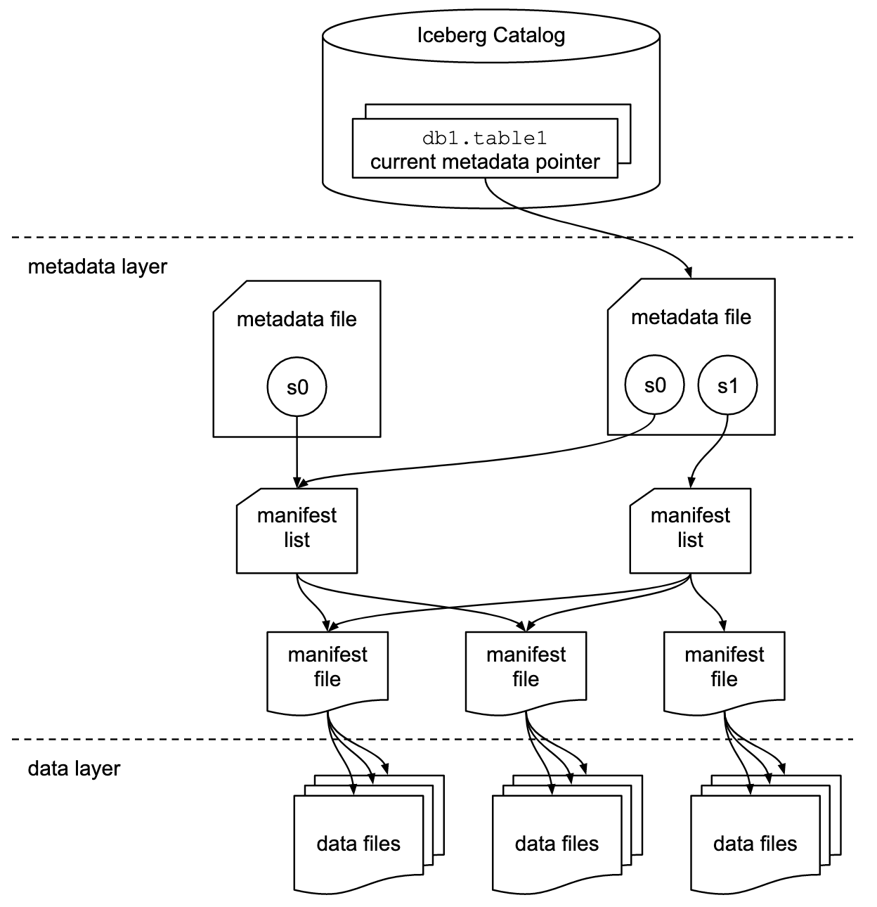
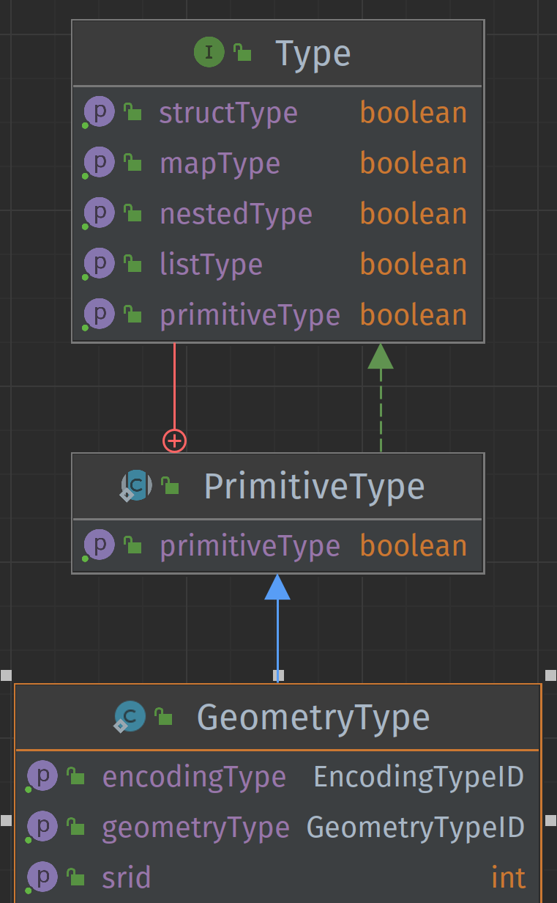
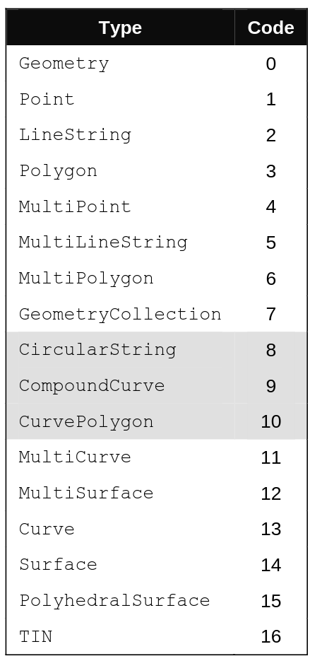
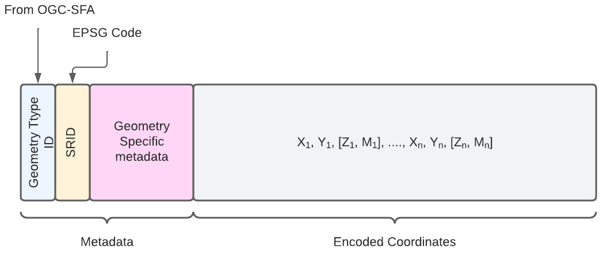
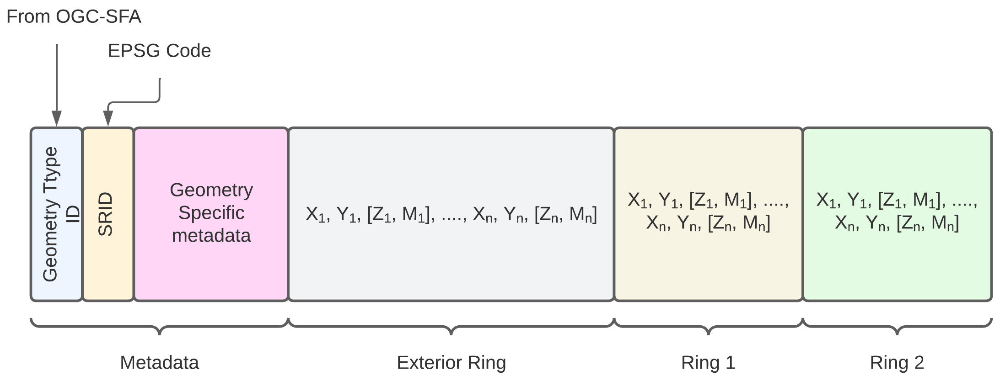
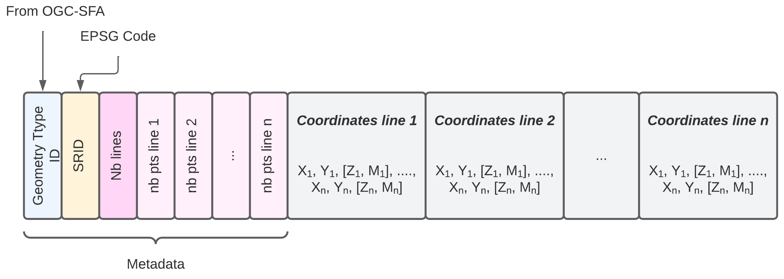
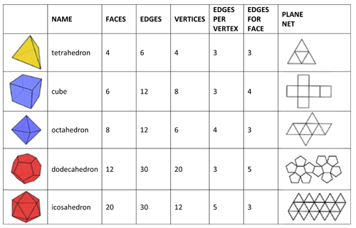
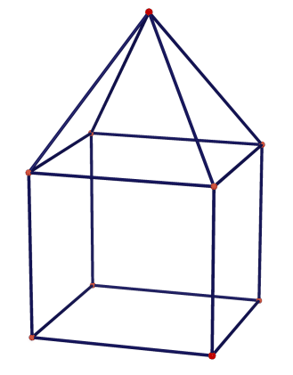

# Specification for a 3D Geometric Type Encoding in Apache Iceberg

## Introduction

This specification, named GeoIceberg, details how to add support for a geometric data type in Apache Iceberg to store geospatial data in an Iceberg table. This specification is based on the use of the **ISO-19107** standard and the **OGC-Simple Feature Access** specification.

It is presently a work in progress and hence it is still in a beta version. This work has been initiated in the context of a MSc research work performed at Université Laval, Québec, Canada, by Xavier Malet and under the supervision of Prof. Thierry Badard. This research work aimed at designing a 3D geospatial data lake engine based on the Trino. For any questions or if you want to contribute, please email to [Thierry Badard](mailto:Thierry.Badard@scg.ulaval.ca).

This specification was last updated on October 20, 2024.

## Context

**Apache Iceberg** is an open-source data management system designed to store, manage, and version large amounts of structured data.

It offers full support for data evolution and partition management. It works with data formats such as Parquet and ORC.

Iceberg is ideal for storing large amounts of data, allowing for seamless schema evolution and reliable large-scale data management.

However, by default, it does not support geometric data types. This specification proposes an encoding that allows the storage of geometric data type within an Apache Iceberg table.

## Recognition of Geometric Type in Apache Iceberg

For the geometric data type to be recognized in Apache Iceberg, it is necessary to add mechanisms for recognition, storage, and management of geometric data in:

- The [`Schema`](https://iceberg.apache.org/spec/#schemas-and-data-types)
    - Saving the type of geometry used
- The [`Partitioning`](https://iceberg.apache.org/spec/#partitioning)
    - Allows defining the geospatial partitioning of a table
- The [`Manifest`](https://iceberg.apache.org/spec/#manifests)
    - Adding geospatial metrics:
        - XMin / XMax / YMin / YMax
        - BBox
- The storage
    - Adding geometric data encoders/decoders for storage formats used by `Apache Iceberg`, namely:
        - Parquet
        - Avro
        - Orc

All of this information is disseminated in the metadata files ([`metadata files`](https://iceberg.apache.org/spec/#table-metadata))
and in the [`manifest files`](https://iceberg.apache.org/spec/#manifests).
The `data files` correspond to storage in `Parquet`, `Orc`, `Avro` type files.

<figure>

<figcaption><i>Iceberg Table Structure</i> ( from : <a href="https://iceberg.apache.org/spec/#overview">Iceberg Spec</a> )</figcaption>
</figure>


The following sections define:

- The geometric data type in Apache Iceberg
- The use and definition of the geometric data type in the Iceberg schema
- Reading/writing geometries in storage files
- The use of geospatial partitioning

## Iceberg Table Schema

To add a geometric data type in Iceberg, it is necessary to define a new geometric data type as defined above.




### Example schema in pseudo-code:

In Java
```javascript
StructType SCHEMA = StructType.of(
    required(
        200, // field id
        "geometry", // field name
        Types.GeometryType.of("pointzm", 2949, 'WKT')   // field type
    )   
);
```

In SQL
```sql
create table TABLE_NAME (
    geom geometry('Pointz',2949,'wkt')
)
```
This nomenclature corresponds to the one used by [`PostGIS`](https://postgis.net/)

### Partitions

If partitioning of geometric data is necessary, the partitioning columns should be planned accordingly. For example, geometric data can be partitioned based on geographic region, date, etc.

Several types of geospatial partitioning can be used such as:

  - [Geohash](https://en.wikipedia.org/wiki/Geohash)
  - [Z-Curve Order](https://en.wikipedia.org/wiki/Z-order_curve)
  - [H3](https://h3geo.org/)
  - [Google S2](https://s2geometry.io/)

For each partitioning, a hash length must be specified to group the different geometries in the same space.

The declaration of geospatial partitioning can be defined as:

```
GEOPARTITION( TYPE (h2, geohash, ...), GEOMETRIC COL. NAME, HASH LENGTH )

## Example

-- spatial partitioning of type h2 with length 5 on the geometry_col column
GEOPARTITION( 'h2',geometry_col , 5 ) 

-- spatial partitioning of type geohash with length 5 on the geometry_col column
GEOPARTITION( 'geohash',geometry_col , 5 ) 

```


#### Example schema in pseudo-code:

In SQL (example with the `Iceberg - Spark` API)

```sql
CREATE TABLE prod.db.sample (
    id bigint,
    geom geometry('pointz',2949,'wkb'))
USING iceberg
PARTITIONED BY (geopartition('geohash',geom, 5))
```

### Indexing

[TO BE COMPLETED]
For optimal search performance, it is possible to add spatial indexes to accelerate
the search for geometric data.


## Reading/Writing Geometric Data

The application using Iceberg must be able to read and write geometric data in the Iceberg table using the appropriate geometric data type.

Geometric data will be stored in a data format compatible with Iceberg, such as Parquet or ORC.
The application must support the conversion of geometric data into this format.


## Definition of Geometric Data Type

The geometric data type must define:

- The type of geometry used (Point, Line, Polygon, ...).
- The coordinate system (in EPSG format).
- The type of encoding used to serialize/deserialize the geometric object in storage files.

The type definition can be created in SQL or command line with the parameters named above.

___Example of type definition:___

```javascript
// Point object with CRS: WGS-84 encoded in WKB
GeometryType("point", 4326, "WKB")

// Point object with CRS: UTM-NAD83 Zone 19 encoded in List
GeometryType("point", 26919, "List")

// Polygon object with CRS: UTM-NAD83 Zone 20 encoded in WKT
GeometryType("polygon", 26920, "WKT")

// PointZ object with CRS: UTM-NAD83 Zone 20 encoded in WKT
GeometryType("pointz", 26920, "WKT")

// PolygonZ object with CRS: UTM-NAD83 Zone 20 encoded in WKT
GeometryType("polygonz", 26920, "WKT")
```

### Supported Geometry Types

The basic objects supported by the [`OGC-Simple Feature Access`](https://www.ogc.org/publications/standard/sfs/) specification are:
<figure>

<figcaption><b>Fig 1</b> : Geometry Type ID From OGC-SFA</figcaption>
</figure>

To support 2.5D geometries, simply add the following values
to define objects in `XYZ`, `XYM` and `XYZM` formats

- `XYZ`: 1000
- `XYM` : 2000
- `XYZM` : 3000

___Example___:

- __PointZ__ : 1001
- __PointM__ : 2001
- __PointZM__: 3001

- __PolygonZ__ : 1003
- __PolygonM__ : 2003
- __PolygonM__: 3003

### Coordinate System

To identify the coordinate system, the use of `EPSG` codes is
prioritized.

### Geometry Encoding

Among existing encodings, we can name:

- ___Well-Known Text (WKT)___: A human-readable textual representation of geometries.
  It is used to store geometries in a readable and interpretable way.


- ___Well-Known Binary (WKB)___: A compact binary representation of geometries,
  making it more efficient for storage and transmission.


- ___Tiny Well-Known Binary (TinyWKB)___: Compact form of __WKB__ used to represent geospatial data
  efficiently. It is primarily designed to reduce the size of geospatial data when
  stored or transmitted, while maintaining a simple binary representation.


- ___GeoJSON___: A JSON format commonly used to represent geospatial objects. It is human-readable
  and supported by many geospatial libraries and tools.

However, to efficiently store geometric data in files supported by Apache Iceberg, list-based encoding types are preferred for efficiency and performance reasons:

- ___Simple List Encoding (SimpleList)___: This encoding is very similar to WKB encoding. However,
  instead of being incorporated into a binary representation, the geometry
  is stored inside an existing container, such as a `List` or `Array` object.
  This encoding can be difficult to read and decode but is more compact.


- ___Nested List Encoding (NestedList)___: Nested list encoding
  allows storing coordinates inside isolated lists and can simplify
  the reading/writing process. This type of encoding is partly used
  in `GeoJSON` type encoding. It is more easily readable by a human
  but is less compact.

To store geometric objects in Apache Iceberg, the following correspondence can be used:

| Chosen Encoding Type | Apache Iceberg Type<br>Correspondence | AVRO Correspondence<br>(from Apache Iceberg spec) | Parquet Correspondence<br>(from Apache Iceberg spec) | Orc Correspondence<br>(from Apache Iceberg spec) |
|------------------------|:--------------------------------------:|:------------------------------------------------:|:---------------------------------------------------:|:-----------------------------------------------:|
| WKT                    |                `string`                |                      String                      |                       binary                        |                     string                      |
| WKB / TinyWKB          |                `binary`                |                      bytes                       |                       binary                        |                     binary                      |
| SimpleList             |            `List( double )`            |                 array[ double ]                  |                    3-level list                     |                 array[ double]                  |
| NestedList             |        `List( List( double ))`         |             array[ array[ double ]]              |                    3-level list                     |             array[ array[ double ]]             |


## List-based Encoding


This section presents the encoding of geometries using simple lists. This type of encoding has notably been proposed by [geoarrow](https://github.com/geoarrow/geoarrow). 
However, different elements have been added to save the metadata of geometries inside the list.

The following diagram presents the basic structure of simple list encoding for geometries.

<figure>
    
    <figcaption>Schematic representation of simple list encoding</figcaption>
</figure>

### Point Encoding (`Point`)

- Metadata
  - Geometry Type ID: `1 ; 1001; 2001; 3001`
  - SRID : `int` 
  - Geometry Specific Metadata : `None`
- Encoded Coordinates
  - X, Y, Z, M

___Example of point encoding___

```python
# SRID : 2949
# Point with coordinates : (10,11)
[1, 2949, 10, 11]

# PointZ with coordinates : (10,11, 5)
[1001, 2949, 10, 11, 5]

# PointM with coordinates : (10,11, -15)
[2001, 2949, 10, 11, -15]

# PointZM with coordinates : (10,11, 5, -15)
[3001, 2949, 10, 11, 5, -15]
```
### Line Encoding (`LineString`)

- Metadata
  - Geometry Type ID: `2 ; 1002; 2002; 3002`
  - SRID : `int` 
  - Geometry Specific Metadata : 
    - dimension (dim): `int` : 2 < `x` < 4
    - number of points (nbp): `int` : > 1
- Encoded Coordinates
  - X<sub>1</sub>, Y<sub>1</sub>, Z<sub>1</sub>, M<sub>1</sub>, X<sub>2</sub>, Y<sub>2</sub>, Z<sub>2</sub>, M<sub>2</sub> ... X<sub>n</sub>, Y<sub>n</sub>, Z<sub>n</sub>, M<sub>n</sub>

___Example of Line encoding___

```python
# SRID : 2949
# Line with coordinates : [ (0,0), (1,1), (5,5) ]
#                              |      |      |   
#                         coord 1   coord 2  coord 3
[2, 2949, 2, 3, 0,0,1,1,5,5]
#               ___ ___ ___
#         |  |   |   |   |
#       dim nbp  c1  c2  c3

# SRID : 2949
# LineZ with coordinates : [ (0,0,0 ), (1,1,2), (5,5,10) ]
#                                |         |       |   
#                            coord 1   coord 2  coord 3
[1002, 2949, 3, 3, 0,0,0,1,1,2,5,5,10]
#                  _____ _____ _____
#            |  |    |     |     |
#          dim nbp  c1     c2    c3


# SRID : 2949
# LineM with coordinates : [ (0,0,10 ), (1,1,11), (5,5,12) ]
#                                |         |       |   
#                            coord 1   coord 2  coord 3
[2002, 2949, 3, 3, 0,0,10,1,1,11,5,5,12]
#                  _____  _____  _____
#            |  |    |      |     |
#          dim nbp  c1     c2    c3

# SRID : 2949
# LineZM with coordinates : [ (0,0,1,10 ), (1,1,5,11), (5,5,9,12) ]
#                                  |            |            |   
#                            coord 1          coord 2       coord 3
[3002, 2949, 4, 3, 0,0,1,10,1,1,5,11,5,5,9,12]
#                  ________ ________ ________
#            |  |      |        |       |
#          dim nbp     c1       c2      c3
```
### Encoding of Multiple Geometries

The encoding of multiple geometries is more complex given that the metadata block becomes more important.

<figure>
  
  <figcaption>Basic encoding scheme for multiple geometries</figcaption>
</figure>

#### Polygon Encoding (`Polygon`)

<figure>
  
  <figcaption>Polygon encoding scheme</figcaption>
</figure>

- Metadata
  - Geometry Type ID: `3 ; 1003; 2003; 3003`
  - SRID : `int` 
  - Geometry Specific Metadata : 
    - dimension (dim): `int` : 2 < `x` < 4
    - Exterior Ring:
      - number of points (nbp): `int` : > 1
    - Interior Rings
      - Ring Number : `int` : 0 < X < n
      - For each ring: `int`
        - number of points (nbp): `int` : > 1
- Encoded Coordinates
  - X<sub>1</sub>, Y<sub>1</sub>, Z<sub>1</sub>, M<sub>1</sub>, X<sub>2</sub>, Y<sub>2</sub>, Z<sub>2</sub>, M<sub>2</sub> ... X<sub>n</sub>, Y<sub>n</sub>, Z<sub>n</sub>, M<sub>n</sub>
  - For each ring:
    - X<sub>1<sub>ring i</sub></sub>, Y<sub>1<sub>ring i</sub></sub>, Z<sub>1<sub>ring i</sub></sub>, M<sub>1<sub>ring i</sub></sub>,
        X<sub>2<sub>ring i</sub></sub>, Y<sub>2<sub>ring i</sub></sub>, Z<sub>2<sub>ring i</sub></sub>, M<sub>2<sub>ring i</sub></sub> ... X<sub>n<sub>ring i</sub></sub>, Y<sub>n<sub>ring i</sub></sub>, Z<sub>n<sub>ring i</sub></sub>, M<sub>n<sub>ring i</sub></sub>

```python
# SRID: 2949
# Polygon with border: [ (0,0) , (0,5) , (5,5) , (5,0) , (0,0) ]
# Ring 1: A1 [ (1,1) , (1,2) , (2,2) , (2,1) , (1,1) ]
# Ring 2: A2 [ (3,3) , (3,4) , (4,4) , (4,3) , (3,3) ]

#          5,5                     5,0
#             ┌───────────────────┐
#             │         4,3   4,4 │
#             │           ┌────┐  │
#             │           │    │  │
#             │           │ a2 │  │
#             │ 2,1  2,2  └────┘  │
#             │  ┌────┐   3,3  3,4│
#             │  │    │           │
#             │  │ a1 │           │
#             │  └────┘           │
#             │ 1,1     1,2       │
#             └───────────────────┘
#           0,0                    0,5


# Polygon with border: [ (0,0) , (0,5) , (5,5) , (5,0) , (0,0) ]
# without ring
[3, 2949, 2, 5, 0 , 0,0 , 0,5 , 5,5 , 5,0 , 0,0]
#         │  │  │   ─┬─   ─┬─   ─┬─   ─┬─   ─┬─
#         │  │  │    │     │     │     │     │
#       dim  │ nr    │     │     │     │     │
#           nbp      c1    c2    c3    c4    c5


# Polygon with border: [ (0,0) , (0,5) , (5,5) , (5,0) , (0,0) ]
# with Ring A1
# Ring 1: A1 [ (1,1) , (1,2) , (2,2) , (2,1) , (1,1) ]
[3, 2949, 2, 5, 1 , 5, 0,0 , 0,5 , 5,5 , 5,0 , 0,0 , 1,1 , 1,2 , 2,2 , 2,1 , 1,1 ]
#         │  │  │   │  ─┬─   ─┬─   ─┬─   ─┬─   ─┬─   ─┬─   ─┬─   ─┬─   ─┬─   ─┬─
#         │  │  │   │   │     │     │     │     │     │     │     │     │     │
#       dim  │ nr   │   │ Exterior coordinates  │     │     │     │     │     │
#                   │   │     |     |     |     │     │ Ring A1 coordinates   │
#           nbp     │   c1    c2    c3    c4    c5    │     │     │     │     │
#                  nbp                                │     │     │     │     │
#                 ring 1                              │     │     │     │     │
#                                                     c1    c2    c3    c4    c5


# Polygon with border: [ (0,0) , (0,5) , (5,5) , (5,0) , (0,0) ]
# with Rings A1, A2
# Ring 1: A1 [ (1,1) , (1,2) , (2,2) , (2,1) , (1,1) ]
# Ring 2: A2 [ (3,3) , (3,4) , (4,4) , (4,3) , (3,3) ]
[3, 2949, 2, 5, 2 , 5, 6 , 0,0 , 0,5 , 5,5 , 5,0 , 0,0 , 1,1 , 1,2 , 2,2 , 2,1 , 1,1 , 3,3 , 3,4 , 4,4 , 4,3 , 2.5,3.5 , 3,3 ]
#         │  │  │   │  │   ─┬─   ─┬─   ─┬─   ─┬─   ─┬─   ─┬─   ─┬─   ─┬─   ─┬─   ─┬─   ─┬─   ─┬─   ─┬─   ─┬─   ─┬─────   ─┬─
#         │  │  │   │  │    │     │     │     │     │     │     │     │     │     │     │     │     │     │     │         │
#       dim  │ nr   │  │    │ Exterior coordinates  │     │     │     │     │     │     │     │     │     │     │         │
#                  nbp │    │     |     |     |     │     │ Ring A1 coordinates   │     │ Ring A2 coordinates   │         │
#           nbp  ring1 │    c1    c2    c3    c4    c5    │     │     │     │     │     │     │     │     │     │         │
#                      nbp                                │     │     │     │     │     c1    c2    c3    c4    c5       c6
#                    ring2                                │     │     │     │     │
#                                                         c1    c2    c3    c4    c5


# PolygonZ: [ (0,0,10) , (0,5,10) , (5,5,10) , (5,0,10) , (0,0,10) ]
# without ring
[3, 2949, 3, 5, 0 , 0,0,10 , 0,5,10 , 5,5,10 , 5,0,10 , 0,0,10]
#         │  │  │   ──┬───   ──┬───   ──┬───   ──┬───   ──┬───
#         │  │  │     │        │        │        │        │
#       dim  │ nr     │        │        │        │        │
#           nbp      c1       c2       c3       c4       c5
```

#### MultiPoints Encoding

- Metadata
  - Geometry Type ID: `4 ; 1004; 2004; 3004`
  - SRID: `int` 
  - Geometry Specific Metadata: 
    - dimension (dim): `int`: 2 < `x` < 4
    - number of points (nbp): `int`: > 1

- Encoded Coordinates
    - X<sub>point 1</sub>, Y<sub>point 1</sub>, Z<sub>point 1</sub>, M<sub>point 1</sub>
    - X<sub>point n</sub>, Y<sub>point n</sub>, Z<sub>point n</sub>, M<sub>point n</sub>

```python
# SRID: 2949
# List of points: [ (0,0) , (0,5) , (5,5) , (5,0)  ]

# Multipoint 
[4, 2949, 2, 4, 0,0 , 0,5 , 5,5 , 5,0]
#         │  │  ─┬─   ─┬─   ─┬─   ─┬─
#       dim  │  p1    p2    p3    p4
#           nbp


# MultipointZ
# List of points: [ (0,0,5) , (0,5,14) , (5,5,34) , (5,0, 12)  ]
[1004, 2949, 3, 4, 0,0,5 , 0,5,14 , 5,5,34 , 5,0,12]
#            │  │  ──┬──   ──┬───   ──┬───   ──┬───
#          dim  │   p1      p2       p3       p4
#              nbp

```

#### Multilines Encoding

<figure>
  
  <figcaption>Polygon encoding diagram</figcaption>
</figure>


- Metadata
  - Geometry Type ID: `5 ; 1005; 2005; 3005`
  - SRID: `int` 
  - Geometry Specific Metadata: 
    - dimension (dim): `int`: 2 < `x` < 4
    - Number of lines: `int`: 0 < X < n
      - For each line: `int`
        - number of points (nbp): `int`: > 1
- Encoded Coordinates
  - For each line:
    - X<sub>1<sub>line i</sub></sub>, Y<sub>1<sub>line i</sub></sub>, Z<sub>1<sub>line i</sub></sub>, M<sub>1<sub>line i</sub></sub>, 
        X<sub>2<sub>line i</sub></sub>, Y<sub>2<sub>line i</sub></sub>, Z<sub>2<sub>line i</sub></sub>, M<sub>2<sub>line i</sub></sub> ... X<sub>n<sub>line i</sub></sub>, Y<sub>n<sub>line i</sub></sub>, Z<sub>n<sub>line i</sub></sub>, M<sub>n<sub>line i</sub></sub>

```python
# SRID: 2949
# Line 1: [ (1,1) , (1,2) , (2,2) , (2,1) ]
# Line 2: [ (3,3) , (3,4) , (4,4) ]
# Line 3: [ (0,0) , (0,5) , (5,5) , (5,10) , (10,10) ]

#              nbp1 nbp3
#               │     │
#               │     │
[5, 2949, 2, 3, 4, 3, 5, 1,1,1,2,2,2,2,1 , 3,3,3,4,4,4, 0,0,0,5,5,5,5,10,10,10]
#         │  │     │     ──────┬────────   ─────┬─────  ───────────┬──────────
#       dim  │     │           │                │                  │
#           nb    nbp2      x,y line 1                       x,y line 3
#          lines                           x,y line 2

# Line 1: [ (1,1,5) , (1,2,12) , (2,2,4) , (2,1,22) ]
# Line 2: [ (3,3,0) , (3,4,12) , (4,4,23) ]
#                 nbp1
#                  │
#                  │
[1005, 2949, 3, 2, 4, 3, 1,1,5,1,2,12,2,2,4,2,1,22 , 3,3,0,3,4,12,4,4,23]
#            │  │     │  ──────────┬──────────────   ─────────┬─────────
#          dim  │     │            │                          │
#              nb    nbp2       x,y,z line 1            x,y,z line 2
#             lines
```

#### MultiPolygons Encoding

TO BE DONE.

### Polyhedra and Solids Encoding (Polyhedral Surface)

Geometrically, a polyhedron can be a 2D/3D structure, and 
a solid is strictly 3D.

Polyhedra and solids are composed of three important elements:

 - `Faces`: basic polygonal geometric shapes (triangle, square, rectangle, ...) that define its exterior.
 - `Vertices`: set of points composing the different `faces`
 - `Edges`: straight lines where two faces meet. Each edge connects two vertices and delimits one or more faces.

The figure below presents different basic polyhedra as well as
the elements that compose them (`faces`, `vertices`, `edges`)


<div style="background-color:white;
text-align:center;">

<figure>

<figcaption>Examples of polyhedra </figcaption>
</figure>

</div>

The proposed encoding ignores the storage of `edges` but stores
the number of `vertices`, the number of `faces`, and for each face, 
the number of points composing the face as well as the indices of these points
in the coordinate list.

<figure>
  
  <figcaption>Polygon encoding diagram</figcaption>
</figure>


- Metadata
  - Geometry Type ID: `15 ; 1015; 2015; 3015`
  - SRID: `int` 
  - Geometry Specific Metadata: 
    - dimension (dim): `int`: 2 < `x` < 4
    - Number of points: `int`: 1 < X < n
    - Number of faces: `int`: 1 < X' < n
      - For each face: `int`
        - number of points (nbp): `int`: > 1
        - index of points in the list `int`:
- Encoded Coordinates
  - All coordinates:
    - X<sub>1</sub>, Y<sub>1</sub>, Z<sub>1</sub>, M<sub>1</sub>, 
        X<sub>2</sub>, Y<sub>2</sub>, Z<sub>2</sub>, M<sub>2</sub> ... X<sub>n</sub>, Y<sub>n</sub>, Z<sub>n</sub>, M<sub>n</sub>


___Example of tetrahedron encoding___
```python

# Tetrahedron encoding
# 
# 4 points
# 
# 0,0,0
# 1,0,0
# 1,1,0
# 1,1,1
# 
# Faces omposition
# 1: 1,2,3
# 2: 1,3,4
# 3: 1,2,4
# 4: 2,3,4

#                 nb        nb pts             nb pts
#               faces      face 2              face 4
#                  │           │  idx pts        │   idx pts
#                  │           │   │             │   │
#                  │           │ ──┴──           │ ──┴──
[1015, 2949, 3, 4, 4, 3,1,2,3 ,3,1,3,4, 3,1,2,4, 3,2,3,4 , 0,0,0, 1,0,0, 1,1,0, 1,1,1]
#            │  │     │ ──┬──           │ ─────            ──┬──  ─────  ──┬──  ─────
#          dim  │     │   │idx pts      │                    │     c2      │     c4
#              nb     │                 │                   c1            c3
#             points  nb pts          nb pts
#                     face 1         face 3
```

Encoding of a square-based pyramid on a cube


```python
# Tetrahedron encoding
# 
# 9 points
# 
# index - coordonnées
# Cube
# 1     - 0,0,0
# 2     - 5,0,0
# 3     - 5,5,0
# 4     - 0,5,0
# 5     - 5,5,5
# 6     - 0,5,5
# 7     - 0,0,5
# 8     - 5,0,5
# Top of the Pyramid
# 9     - 2.5,7.5,2.5
# 
# Faces omposition

# Cube 
# 1,2,3,4
# 1,7,6,4
# 7,8,5,6
# 2,3,5,8
# 1,2,8,7

# Pyramide
# 3,4,9
# 4,6,9
# 5,6,9
# 3,5,9


#                 nb          cube nb pts                nb pts
#               faces           face 2                face 4
#                  │             │  idx pts            │   idx pts
#                  │             │   │                 │   │
#                  │             │ ──┴────             │ ──┴────
[1015, 2949, 3, 4, 4, 4,1,2,3,4, 4,1,7,6,4, 4,7,8,5,6, 4,2,3,5,8, 4,1,2,8,7,
#            │  │     │ ──┬────             │ ────────            │ ────────
#          dim  │     │   │idx pts          │                     │
#              nb     │                     │                     │
#             points  cube nb pts       cube nb pts           cube nb pts
#                     face 1              face 3                face 5
# Pyramide
3,3,4,9, 3,4,6,9, 3,5,6,9, 3,3,5,9,
# ─────  │ ─────  │ ─────  │ ─────
#        └┐       │        │
#nb pts   │       │        │
#pyr     nb pts   │         nb pts
#face 1  pyr       nb pts   pyr
#       face 2     pyr     face 4
#                 face 3
# Vertices
0,0,0, 5,0,0, 5,5,0, 0,5,0, 5,5,5, 0,5,5, 0,0,5, 5,0,5, 2.5,7.5,2.5 ]
#────  ─────  ─────  ─────  ─────  ────── ─────  ─────  ───────────
# c1     c2   c3       c4    c5      c6     c7     c8       c9
```

## Implementations

- Geo3DTrino: a 3D geospatial data lake engine based on Trino.

## License

This specification and its translations are released under a [Creative Commons Attribution 4.0 International License](https://creativecommons.org/licenses/by/4.0/).

## References

- [OGC-Simple Feature Access](https://portal.ogc.org/files/?artifact_id=25355)
- [ISO-19107](https://www.iso.org/fr/standard/66175.html)
- [EPSG Codes](https://epsg.io/)
- [PostGIS](https://postgis.net/)
- [GeoArrow Spec](https://github.com/geoarrow/geoarrow)
- [GeoParquet](https://github.com/opengeospatial/geoparquet)
- [FlatGeoBuff](https://flatgeobuf.org/)
